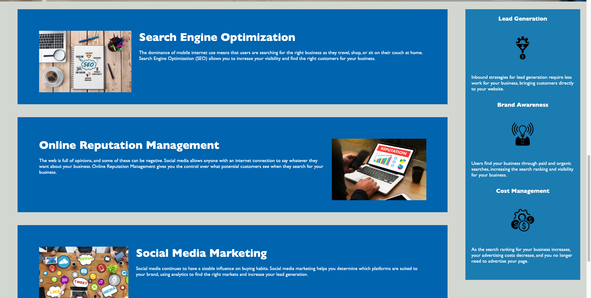

# refactored-code

## Horiseon homepage

As the title of the repository suggests, I have simply refactored the source code for Horiseon's homepage.

### HTML edits
First, I went through the HTML page and edited the semantic tags to be more description rather than simple `
` tags. 

Second, I added `<alt>` attributes for each of the anchored images, and I added a `<title>` attribute to the background image dividing the navigation bar and the main content on the page. 

Third, I fixed the navbar links so that they directed the user to the appropriate section on the page. 

Finally, I added comments to the HTML page so that anyone else navigating their way around the source code will have an easier time distinguishing between the HTML elements and their functions. 

### CSS edits
First, I consolidated blocks of CSS so that there weren't repetetive blocks (this required editing classes in the HTML so that I could use fewer CSS selectors). 

Second, I modified the CSS so that it would be responsive to different sized viewports. 

Third, and related to the second CSS task, I added a @media rule to ensure that the application looks clean on tablets and mobile devices. 

Finally, I added comments to the CSS page so that anyone else navigating their way around the source code will have an easier time distinguishing between the CSS selectors and their functions. 

## Deployment
To deploy this website, simply follow this [link](https://rflctveq.github.io/refactored-code/) or enter the following into your address bar: https://rflctveq.github.io/refactored-code/. 

## Screenshots

Here's a desktop image of the navigation bar, as well as part of the large background image dividing the navigation bar and the main content of the page: 

Here's a little further down the page:

Here's a mobile image of the navigation bar, the dividing background image, and some of the main content: 

Here's a little further down the page: 

